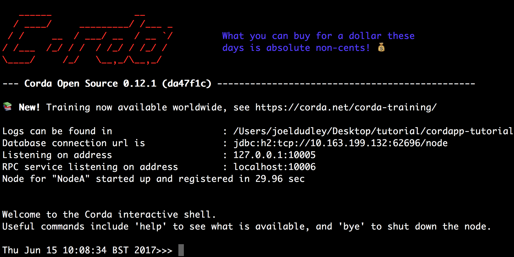

# CorDapp Restaurant Reservation

A rudimentary implementation of blockchain restaurant reservations using Corda and Kotlin.
This is merely an attempt to get acquainted with the platform based on the 
[CorDapp Kotlin template](https://github.com/corda/cordapp-template-kotlin), 
a stubbed-out CorDapp used to quickly bootstrap CorDapp projects.

## Pre-Requisites

You will need the following installed on your machine before you can start:

* [JDK 8](http://www.oracle.com/technetwork/java/javase/downloads/jdk8-downloads-2133151.html) 
  installed and available on your path (Minimum version: 1.8_131). OpenJDK users _must_ also 
  install OpenJFX (e.g. with `sudo apt-get install openjfx`)
* [IntelliJ IDEA](https://www.jetbrains.com/idea/download/) (Minimum version 2017.1)
* git
* Optional: [h2 web console](http://www.h2database.com/html/download.html)
  (download the "platform-independent zip")

For more detailed information, see the
[getting set up](https://docs.corda.net/getting-set-up.html) page on the
Corda docsite.

## Getting Set Up

To get started, clone this repository with:

     git clone https://github.com/manosbatsis/cordapp-restaurant-reservation.git

And change directories to the newly cloned repo:

     cd cordapp-restaurant-reservation

## Building the CorDapp template:

**Unix:** 

     ./gradlew deployNodes

**Windows:**

     gradlew.bat deployNodes

Note: You'll need to re-run this build step after making any changes to
the template for these to take effect on the node.

## Running the Nodes

Once the build finishes, change directories to the folder where the newly
built nodes are located:

     cd build/nodes

The Gradle build script will have created a folder for each node. You'll
see three folders, one for each node and a `runnodes` script. You can
run the nodes with:

**Unix:**

	./runnodes --log-to-console --logging-level=DEBUG

**Windows:**

	runnodes.bat --log-to-console --logging-level=DEBUG

You should now have three Corda nodes running on your machine serving 
the template.

When the nodes have booted up, you should see a message like the following 
in the console: 

     Node started up and registered in 5.007 sec
     

     
## Issuing a reservation

Now that the nodes are running, let’s order one of them to create a reservation 
by kicking off our ReservationFlow. In a larger app, we’d generally provide a web API 
sitting on top of our node. Here, for simplicity, we’ll be interacting with the node 
via its built-in CRaSH shell.

Go to the terminal window displaying the CRaSH shell of PartyA. Typing help will 
display a list of the available commands.

We want to create a reservation for two persons with PartyB. We start the 
ReservationFlow by typing:

	start ReservationFlow personsValue: 2, guestParty: "O=PartyB,L=New York,C=US"

This single command will cause PartyA and PartyB to automatically agree a reservation. 
This is one of the great advantages of the flow framework - it allows you to reduce 
complex negotiation and update processes into a single function call.

If the flow worked, it should have recorded a new reservation in the vaults of both 
PartyA and PartyB. We can check the contents of each node’s (PartyA/B) vault by running:

	run vaultQuery contractStateType: com.template.ReservationState

## Interacting with the CorDapp via HTTP

The CorDapp defines a couple of HTTP API end-points and also serves some
static web content. Initially, these return generic template responses.

The nodes can be found using the following port numbers, defined in 
`build.gradle`, as well as the `node.conf` file for each node found
under `build/nodes/partyX`:

     PartyA: localhost:10007
     PartyB: localhost:10010

As the nodes start up, they should tell you which host and port their
embedded web server is running on. The API endpoints served are:

     /api/template/templateGetEndpoint

And the static web content is served from:

     /web/template

## Using the Example RPC Client

The `ExampleClient.kt` file is a simple utility which uses the client
RPC library to connect to a node and log its transaction activity.
It will log any existing states and listen for any future states. To build 
the client use the following Gradle task:

     ./gradlew runTemplateClient

To run the client:

**Via IntelliJ:**

Select the 'Run Template RPC Client'
run configuration which, by default, connect to PartyA (RPC port 10006). Click the
Green Arrow to run the client.

**Via the command line:**

Run the following Gradle task:

     ./gradlew runTemplateClient
     
Note that the template rPC client won't output anything to the console as no state 
objects are contained in either PartyA's or PartyB's vault.

## Running the Nodes Across Multiple Machines

The nodes can also be set up to communicate between separate machines on the 
same subnet.

After deploying the nodes, navigate to the build folder (`build/
nodes`) and move some of the individual node folders to 
separate machines on the same subnet (e.g. using a USB key). It is important 
that no nodes - including the network map/notary node - end up on more than one 
machine. Each computer should also have a copy of `runnodes` and 
`runnodes.bat`.

For example, you may end up with the following layout:

* Machine 1: `NetworkMapAndNotary`, `PartyA`, `runnodes`, `runnodes.bat`
* Machine 2: `PartyB`, `PartyC`, `runnodes`, `runnodes.bat`

You must now edit the configuration file for each node, including the 
network map/notary. Open each node's config file (`[nodeName]/node.conf`), and make 
the following changes:

* Change the P2P address to the machine's ip address (e.g. 
  `p2pAddress="10.18.0.166:10005"`)
* Change the network map address to the ip address of the machine where the 
  network map/notary node is running (e.g. `networkMapService { address="10.18.0.166:10002"...`) 
  (please note that the network map/notary will not have a network map address entry)

Each machine should now run its nodes using `runnodes` or `runnodes.bat` 
files. Once they are up and running, the nodes should be able to communicate 
among themselves in the same way as when they were running on the same machine.

## Further reading

Tutorials and developer docs for CorDapps and Corda are
[here](https://docs.corda.net/).
